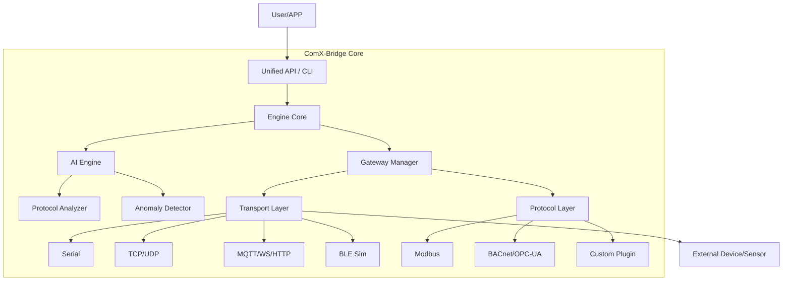

# ComX-Bridge
### Universal AI Communication Engine

> **"Connect all communications, analyze with AI, and extend with plugins."**

[](https://golang.org/)
[](LICENSE)
[](https://github.com/commatea/ComX-Bridge)

> [!IMPORTANT]
> **This project is currently in Pre-Test stage.**
> While core functionality has been implemented, comprehensive integration testing and validation have not been completed. Thorough testing is required before production deployment.

**ComX-Bridge** is an **open-source communication middleware** that integrates and manages all communications from legacy industrial equipment (Serial, Modbus) to modern IoT devices (MQTT, BLE) with a single engine. Beyond simple data transmission, the built-in **AI Engine** automatically analyzes packets and detects anomalies, enhancing system reliability.

---

## 💡 Capabilities

With ComX-Bridge, you can build the following systems with configuration only, no complex coding required:

1.  **Cloud/IoT Transition for Legacy Equipment**
    *   Convert data from old RS-485/Serial devices to TCP, MQTT, or WebSocket for transmission to the web or cloud.
    *   Example: "transmit Modbus data from a 20-year-old PLC to AWS IoT Core in real-time."

2.  **Intelligent Bridge Between Heterogeneous Protocols**
    *   Connect Device A and Device B that use different communication methods.
    *   The AI acts as an intermediary to automatically convert data formats or filter data.
    *   Example: "Receive BLE sensor data and map it to registers in a Modbus TCP server."

3.  **Automatic Protocol Analysis & Reverse Engineering**
    *   The AI analyzes unknown binary packets from undocumented equipment to deduce their structure (header, length, checksum).
    *   Example: "Feed RS-232 communication logs from a defunct manufacturer's device to generate a protocol specification."

4.  **Real-time Communication Monitoring & Security/Anomaly Detection**
    *   Monitor communication traffic in real-time and send immediate alerts when unusual patterns (anomalies) occur.
    *   Example: "Detect sensors sending abnormal values or transmitting at irregular intervals due to hacking or malfunction."

---

## ✨ Advantages

*   **Faster Development (No-Code/Low-Code)**: Build data pipelines using only YAML/JSON configuration files without writing complex communication code.
*   **Powerful Compatibility (All-in-One)**: Supports all major industrial/IoT protocols including Serial, TCP, UDP, BLE, and MQTT.
*   **Intelligent Operations (AI Inside)**: Goes beyond simple connections by understanding data meaning and preventing issues proactively.
*   **Flexible Extensibility (Plugin System)**: Easily add custom logic using Go/Lua/JS plugins alongside standard features.
*   **Run Anywhere (Cross-Platform)**: A single binary runs on all environments including Windows, Linux (x86/ARM), macOS, and Docker.

---

## 📋 Feature List

### 1. Connectivity
*   **Physical Layer**: Serial (RS-232/422/485), Bluetooth Low Energy (BLE)
*   **Network Layer**: TCP/IP (Client/Server), UDP (Unicast/Multicast)
*   **Application Layer**: MQTT v3.1.1 (Client), WebSocket (Client/Server), HTTP/HTTPS (Client/Server)

### 2. Protocols
*   **Industrial**: Modbus RTU/TCP (Master/Slave), OPC-UA (Basic), BACnet/IP (Basic)
*   **Generic**: Raw Binary (Stream), Line-based (Text), Hex-String
*   **Dynamic**: User-defined structure-based dynamic protocols (YAML config)

### 3. AI Engine
*   **Protocol Analyzer**: Hybrid analysis (Heuristic + LLM) for unknown binary data
*   **Auto-Config Generator**: Automatically generates `config.yaml` from analysis results
*   **Code Generator**: Auto-generates Lua parsers and Go structs for custom protocols
*   **Anomaly Detector**: Statistical anomaly detection for communication intervals, values, and packet sizes (Z-Score)
*   **Generative AI**: Natural Language (Text-to-Config) for configuration generation and control
*   **LLM Providers**: Support for OpenAI, Google Gemini, Anthropic Claude, Ollama
*   **Auto Optimizer**: Automatic tuning of timeouts and retries
*   **Digital Twin**: Device simulation and virtual testing

### 4. Extensibility
*   **Plugin System**: Go (.so) and Script (Lua/JavaScript) based plugins
*   **Language Bindings**: APIs for integration with C/C++, C#, Python, Rust, etc.
*   **Remote Control**: Remote control and monitoring via gRPC/WebSocket APIs

### 5. Production Ready
*   **Reliability**: Config Validation, Panic Recovery, Data Persistence (SQLite Buffering), Active-Standby Failover
*   **Security**: Multi-User Authentication (JWT/API Key), TLS/mTLS Encryption, Role-based Access
*   **Observability**: Structured Logging (JSON), Prometheus Metrics
*   **Management**: Web Admin Dashboard (React)

---

## 🚀 Getting Started

### 1. Installation

Go language must be installed (1.24+ recommended).

```bash
# Download source and build
git clone https://github.com/commatea/ComX-Bridge.git
cd ComX-Bridge
go build -o comx.exe ./cmd/comx
```

### 2. Configuration

Create a `config.yaml` file to define gateways.

```yaml
# config.yaml example
version: "1.0"

gateways:
  # 1. Modbus RTU Gateway (Serial)
  - name: "machinery-01"
    enabled: true
    transport:
      type: "serial"
      address: "COM3" # Windows
      options:
        baudrate: 9600
    protocol:
      type: "modbus-rtu"
      options:
        slave_id: 1

  # 2. MQTT Uplink (Cloud)
  - name: "cloud-uplink"
    enabled: true
    transport:
      type: "mqtt"
      options:
        broker: "tcp://broker.emqx.io:1883"
        topic: "factory/data"

ai:
  enabled: true
  features:
    anomaly_detection: true # Enable anomaly detection
    protocol_analysis: true # Enable packet analysis
```

### 3. Usage

```bash
# 1. Start Engine
./comx.exe start -c config.yaml

# 2. Check Status
./comx.exe status

# 3. Data Transmission Test (CLI)
# Send data to machinery-01 gateway
./comx.exe send machinery-01 "010300000001840A" --hex
```

---

## 📚 Documentation

For more details, please refer to the documents in the `docs/` directory.

| Document | Description |
|------|------|
| [📖 Architecture](docs/architecture/ARCHITECTURE.md) | System overview and data flow |
| [📖 Transports](docs/transports/README.md) | Guides for Serial, TCP, UDP, BLE drivers |
| [📖 Protocols](docs/protocols/README.md) | Details on Modbus, BACnet, OPC-UA protocols |
| [📖 AI Engine](docs/ai/README.md) | Anomaly detection, code generation, NLP features |
| [📖 Plugins](docs/plugins/README.md) | Plugin development and extension guide |
| [📖 Bindings](docs/bindings/README.md) | Integration guides for C/C++, C#, Python |
| [📖 Production Guide](docs/production-guide.md) | Security, HA, and monitoring configuration |
| [📖 Rule Engine](docs/features/rule-engine.md) | Lua/JS based edge rule engine guide |
| [📖 Web Admin](docs/features/web-admin.md) | Web Admin Dashboard usage |

---

## 🏗️ Architecture



---

## ✅ Status

| Category | Feature | Status | Note |
|----------|---------|--------|------|
| **Core** | Engine / Config / CLI | ✅ Done | |
| **Transport** | Serial / TCP / UDP | ✅ Done | |
| | MQTT / WebSocket / HTTP | ✅ Done | |
| | BLE | ✅ Done | Real Implementation (TinyGo) |
| **Protocol** | Raw / Modbus RTU / TCP | ✅ Done | |
| | BACnet (BVLC) | ✅ Done | Basic structure implemented |
| | OPC-UA (OCPF) | ✅ Done | Header parsing implemented |
| **AI** | Protocol Analyzer | ✅ Done | Heuristic |
| | Anomaly Detector | ✅ Done | Statistical (Z-Score) |
| | Code Generator | ✅ Done | Template Based |
| | NLP Commander | ✅ Done | Keyword Based |
| | LLM Providers | ✅ Done | OpenAI/Gemini/Claude/Ollama |
| | Auto Optimizer | ✅ Done | Timeout/Retry Tuning |
| | Digital Twin | ✅ Done | Device Simulation |
| **Binding** | C API / gRPC | ✅ Done | Source implemented (GCC/Protoc required) |
| **API** | gRPC Server | ✅ Done | pkg/api/grpc |
| | WebSocket API | ✅ Done | Pub/Sub supported |
| **Production** | Security (Auth/TLS) | ✅ Done | JWT, Multi-User, mTLS |
| | Persistence (SQLite) | ✅ Done | Auto-Retry Buffering |
| | HA (Failover) | ✅ Done | Active-Standby |
| **Feature** | Web Admin | ✅ Done | React Dashboard |
| | Edge Rule Engine | ✅ Done | Lua + JavaScript |

---

## 🤖 AI Collaboration Disclosure

This project was developed through **collaboration between a Human Architect and AI**.

*   **Ideation & Architecture**: The overall project idea, core architecture, and interface design were conceptualized and designed by a **Human Architect**.
*   **Code Implementation**: The actual source code implementation, refactoring, and debugging were performed by **Google Gemini** and **Anthropic Claude** AI models.

> **Note**: This project demonstrates the capabilities of Agentic AI. The **Idea and Architecture** were strictly conceptualized by a human, while the **Code Generation** was primarily executed by AI Agents (Gemini & Claude).

---

## License

Apache License 2.0. See [LICENSE](LICENSE) for details.
