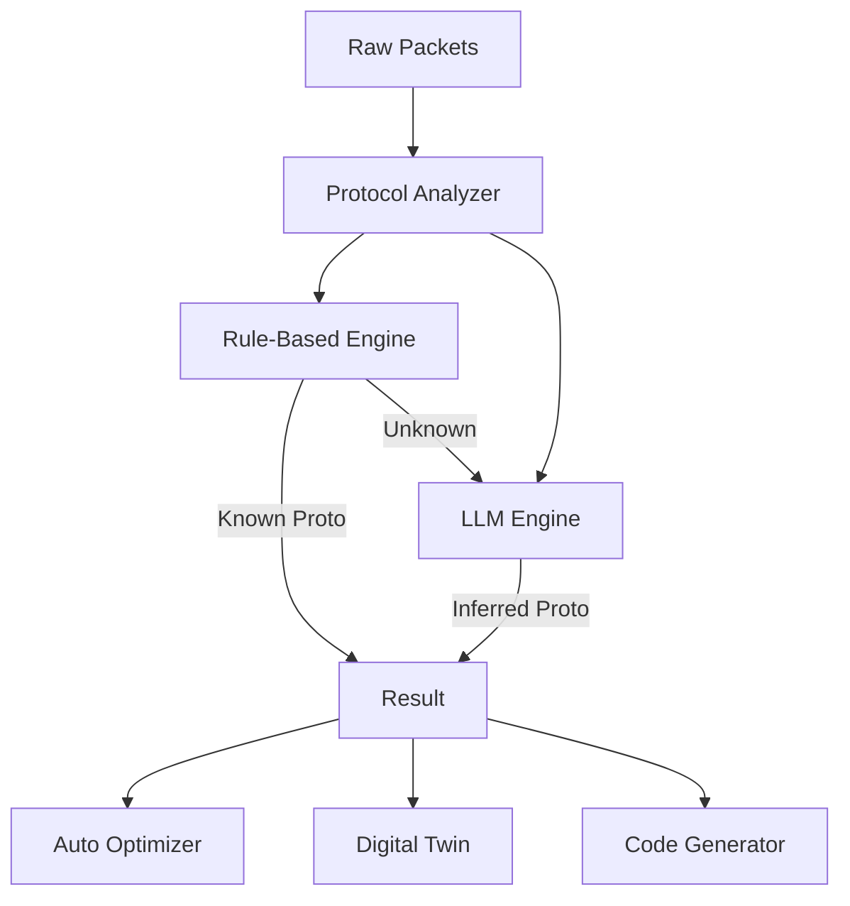

# ComX-Bridge AI Engine

ComX-Bridge employs a **Hybrid AI Engine** combining rule-based heuristics and Large Language Models (LLM) to deliver intelligent industrial connectivity.

## Core Features

### 1. Hybrid Protocol Analyzer
Automatically detects and parses communication protocols by analyzing raw packet streams.
*   **Rule-Based (Heuristic) Analysis**: Instantly detects known patterns like Modbus RTU/TCP, HTTP, and JSON with near-zero latency.
*   **LLM-Based (Generative) Analysis**: Uses Generative AI to infer the structure of unknown or proprietary binary protocols from hex dumps.

### 2. Anomaly Detection
Real-time statistical analysis to detect communication anomalies.
*   **Statistical Analysis (Z-Score)**: Automatically calculates Mean/StdDev to detect packet size or frequency deviations.
*   **Threshold-based Alerting**: Triggers warnings when Z-Score exceeds threshold (default 3.0).

### 3. Text-to-Config (LLM)
Generates valid `config.yaml` or Lua scripts from natural language descriptions.
*   "Add a Modbus TCP device at 192.168.1.100 reading registers 10 to 20 every second."

### 4. Auto Optimizer
Automatically tunes communication parameters based on runtime performance.
*   **Timeout Calibration**: Dynamically adjusts timeout values from historical response times.
*   **Retry Strategy**: Optimizes retry interval and maximum attempts.
*   **Connection Pooling**: Recommends optimal pool size based on load.

### 5. Digital Twin
Simulates device behavior for testing and development without physical hardware.
*   **Device Modeling**: Learns device communication patterns from captured packets.
*   **Virtual Testing**: Enables offline development and integration testing.
*   **Predictive Simulation**: Models expected device responses for new commands.

### 6. Code Generation
Automatically generates parsing code from analyzed protocol structures.
*   **Lua/JavaScript Parsers**: For use in the Edge Rule Engine.
*   **Go Plugins**: For high-performance production use.
*   **Config Snippets**: Gateway configuration YAML from analysis results.

## Architecture



## Configuration

To enable AI features, configure the provider in `config.yaml`:

```yaml
ai:
  enabled: true
  features:
    protocol_analysis: true
    anomaly_detection: true
    auto_optimizer: false    # Enable for parameter tuning
    digital_twin: false      # Enable for device simulation
  
  llm:
    provider: "gemini" # or openai, anthropic, ollama
    api_key: "YOUR_API_KEY"
    model: "gemini-1.5-flash"
```

## Related

- [Edge Rule Engine](../features/rule-engine.md) - Use AI-generated scripts
- [Protocol Guide](../protocols/README.md) - Supported protocols

