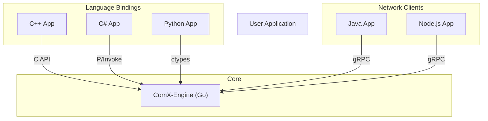

# ComX-Bridge Language Bindings

ComX-Bridge fundamentally provides **C API (FFI)** and **gRPC API** for integration with various programming languages and environments.

## 🌍 Supported Languages and Methods

| Language | Binding Method | Performance | Difficulty |
|------|-------------|------|--------|
| **C/C++** | C API (FFI) | ⭐⭐⭐⭐⭐ | Medium |
| **C#/.NET** | C API + P/Invoke | ⭐⭐⭐⭐⭐ | Easy |
| **Python** | C API + ctypes/cffi | ⭐⭐⭐⭐ | Easy |
| **Java** | gRPC or JNI | ⭐⭐⭐⭐ | Medium |
| **Node.js** | gRPC or N-API | ⭐⭐⭐⭐ | Easy |
| **Rust** | C API (FFI) | ⭐⭐⭐⭐⭐ | Medium |
| **Others** | REST API / gRPC | ⭐⭐⭐ | Easy |

## 📚 Detailed Binding Guides

### 🔹 Language Specific
*   **[C++ Binding Guide](bindings-cpp.md)**: C++ Class Wrappers and CMake/Makefile setup
*   **[C# Binding Guide](bindings-csharp.md)**: .NET P/Invoke implementation and WPF/WinForm examples
*   **[Python Binding Guide](bindings-python.md)**: `ctypes` based wrapper and data analysis integration
*   **[C API Reference](c-api.md)**: Full specification of `comx.h` functions and structs

### 🔹 Network API (Network & RPC)
*   **[gRPC API Guide (Client)](grpc-api.md)**: Proto specs for remote control and Java/Node.js integration
*   **[gRPC Server Guide](grpc-server.md)**: Understanding server architecture and custom service extensions
*   **[WebSocket API Guide](websocket-api.md)**: Real-time bidirectional communication and Pub/Sub patterns

### 🔹 Internal Reference
*   **[Binding Implementation Details](implementation.md)**: CGO bridge code and gRPC server internals (For Contributors)

## 🏗️ Architecture

## 🚀 Which method should I choose?

| Feature | C API (FFI) | gRPC API |
|------|-------------|----------|
| **Performance** | ⭐⭐⭐⭐⭐ (Native) | ⭐⭐⭐⭐ (High) |
| **Integration** | Medium (Memory Management) | Easy (Auto Code Gen) |
| **Use Case** | Embedded, High-Perf Local, Legacy C++ | Microservices, Web Backend, Distributed Sys |
| **Languages** | C, C++, C#, Python, Rust, Delphi etc. | Java, Kotlin, Node.js, Python, Ruby, Go, C# etc. |
